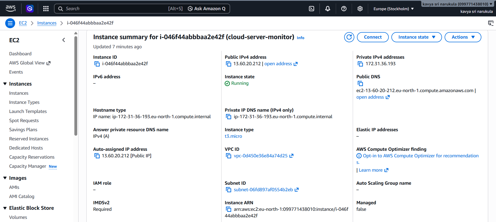
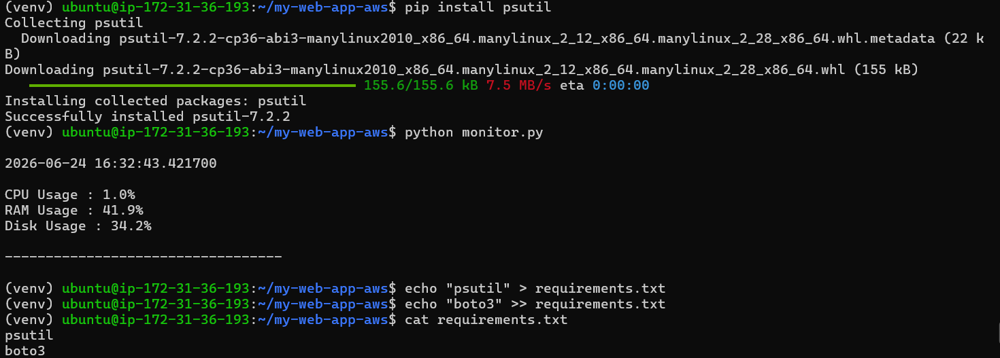
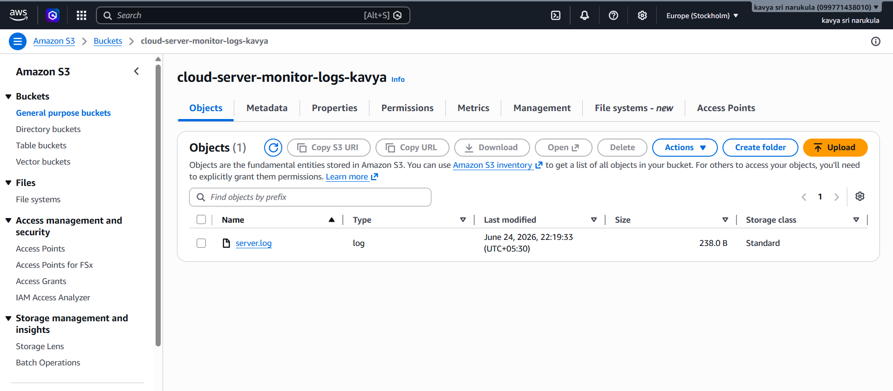

# Cloud Server Monitoring & Log Archival System using AWS

## Project Description

Cloud Server Monitoring & Log Archival System is a cloud-based infrastructure monitoring solution developed using Python and AWS services. The application continuously monitors critical server performance metrics including CPU usage, memory utilization, and disk usage on an AWS EC2 instance. Monitoring data is stored in log files and automatically archived to Amazon S3 for secure storage and future analysis.

This project demonstrates practical experience in cloud deployment, Linux administration, infrastructure monitoring, automation, and AWS service integration.

---

## Key Features

- Real-time CPU monitoring
- Real-time RAM monitoring
- Disk utilization monitoring
- Log file generation and management
- Automated log archival to Amazon S3
- Deployment on AWS EC2
- Secure credential handling using environment variables
- Git and GitHub version control

---

## Technology Stack

- Python
- AWS EC2
- AWS S3
- boto3
- psutil
- Linux (Ubuntu)
- Git
- GitHub

---

## System Architecture

```text
AWS EC2 Instance
        │
        ▼
Python Monitoring Script
        │
        ▼
Server Log Generation
        │
        ▼
Amazon S3 Bucket
```

---

## Project Structure

```text
cloud-server-monitor/
│
├── logs/
│   └── server.log
│
├── screenshots/
│   ├── ec2-instance-running.png
│   ├── server-monitoring-output.png
│   ├── s3-upload-success.png
│   └── s3-bucket-log-file.png
│
├── monitor.py
├── upload_to_s3.py
├── requirements.txt
└── README.md
```

---

## Deployment Process

1. Launch an AWS EC2 Ubuntu instance.
2. Clone the GitHub repository onto the server.
3. Create and activate a Python virtual environment.
4. Install project dependencies.
5. Execute the monitoring script to generate server logs.
6. Upload generated logs to Amazon S3 using boto3.
7. Verify successful archival in the S3 bucket.

---

## Screenshots

### AWS EC2 Instance Running



### Server Monitoring Output



### Successful Upload to Amazon S3


### Log File Stored in Amazon S3



---

## Skills Demonstrated

- Cloud Computing
- AWS EC2 Deployment
- Amazon S3 Storage Management
- Linux Server Administration
- Python Automation
- Infrastructure Monitoring
- Log Management
- Git & GitHub
- Secure Credential Management

---

## Future Enhancements

- Email alerts for resource threshold breaches
- AWS CloudWatch integration
- Automated scheduling using Cron Jobs
- Web-based monitoring dashboard
- Multi-server monitoring support

---

## Author

**Kavya Sri**  
B.Tech Computer Science and Engineering  
SRKR Engineering College